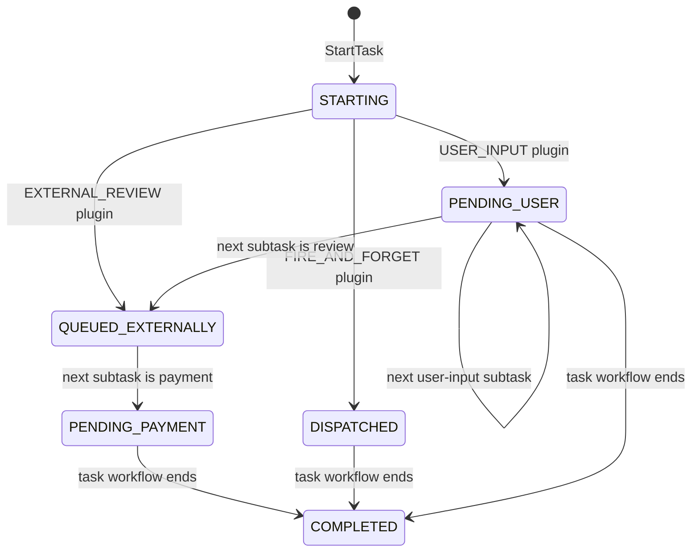
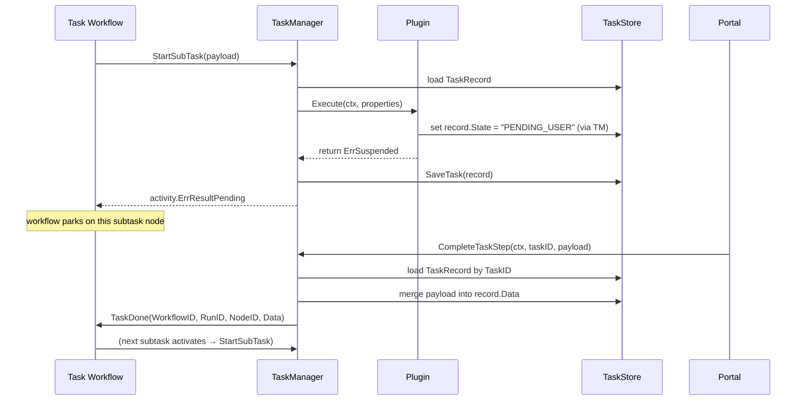

# Architecture

This document is the conceptual reference for the library. Every other guide assumes you've read this one.

## The three layers

The orchestrator separates a long-running business process from the interactive steps that fulfil it, by splitting work across three layers:

| Layer               | Workflow engine instance                | Responsibility                                                                             |
|---------------------|-----------------------------------------|--------------------------------------------------------------------------------------------|
| **Parent Workflow** | Macro workflow on the parent task queue | The end-to-end business journey. Knows nothing about forms, payments, or external systems. |
| **Task**            | Child workflow on the task task queue   | A self-contained micro-flow that fulfils one parent-workflow node.                         |
| **SubTask**         | A node *inside* a Task workflow         | One interaction step (form, API call, payment) executed by a plugin.                       |

The parent workflow only ever sees TASK nodes. It doesn't know — and doesn't need to know — that a single task is internally a workflow with five subtasks.

## Flow diagram

```
[Parent Workflow]                  ← Temporal workflow on parent queue
       │
       │ hits a TASK node
       ▼
parentTaskHandler(payload)
       │
       │ calls TaskManager.StartTask
       ▼
[TaskManager]
       │
       ├──► persists a TaskRecord (state=STARTING)
       │     with parent coordinates: (workflowID, runID, nodeID)
       │     and chooses TaskID = payload.NodeID
       │
       ├──► starts a child Task workflow on the task queue
       │
       └──► returns activity.ErrResultPending
            (parent activity is now suspended)


[Task Workflow]                    ← Temporal workflow on task queue
       │
       │ hits a SUBTASK node
       ▼
taskHandler(payload)
       │
       │ calls TaskManager.StartSubTask
       ▼
[TaskManager]
       │
       ├──► loads TaskRecord by TaskWorkflowID
       ├──► resolves SubTaskTemplate from registry
       ├──► looks up plugin by TaskType
       └──► plugin.Execute(...)
              │
              ├─ returns nil          → sync completion, workflow advances
              ├─ returns ErrSuspended → ErrResultPending, workflow parks
              └─ returns other error  → workflow fails

External event (HTTP POST from the portal, webhook, etc.)
       │
       ▼
TaskManager.CompleteTaskStep(ctx, taskID, payload)
       │
       ├──► merges payload into TaskRecord.Data
       └──► calls TemporalManager.TaskDone(...)
              │
              ▼
       [Task Workflow] resumes the parked subtask and advances


[Task Workflow] reaches END
       │
       ▼
taskCompletionHandler(workflowID, vars)
       │
       │ calls TaskManager.HandleTaskCompletion
       ▼
[TaskManager]
       │
       ├──► marks TaskRecord state=COMPLETED
       └──► invokes onTaskCompleted callback
              │
              ▼
       [Parent Workflow] resumes the parked TASK node
```

## The `TaskRecord`: one row, three roles

A single `store.TaskRecord` is the source of truth for everything about a task. It carries three distinct sets of fields:

```go
type TaskRecord struct {
    // 1. Identity
    TaskID       string          // = ParentNodeID; how external callers address this task
    TaskType     string          // user-facing category from the TaskTemplate (e.g. "APPLICATION")
    State        string          // current lifecycle state (drives rendering)
    RenderConfig json.RawMessage // snapshotted render config for this task

    // 2. Parent coordinates — used to wake the parent workflow on completion
    ParentWorkflowID string
    ParentRunID      string
    ParentNodeID     string

    // 3. Active subtask coordinates — used to resume the currently parked step
    TaskWorkflowID       string
    TaskRunID            string
    SubTaskNodeID        string
    ActiveTaskTemplateID string

    // 4. Dynamic state — accumulated namespaced inputs/outputs across all subtasks
    Data map[string]any

    CreatedAt, UpdatedAt time.Time
}
```

Two coordinate sets, never both active at once:

- **Parent coordinates** are written once at `StartTask` and consumed once at `HandleTaskCompletion`.
- **Active subtask coordinates** are overwritten every time a new subtask becomes active, and consumed when `CompleteTaskStep` resumes it.

## Lifecycle and states

`TaskRecord.State` is plain string for flexibility — it's set by plugins and read by the renderer. The orchestrator itself only ever writes two values:

- `STARTING` — set by `StartTask` before the task workflow runs its first subtask.
- `COMPLETED` — set by `HandleTaskCompletion` when the task workflow ends.

Everything else is a plugin's responsibility:

| Plugin (built-in)                 | State set                                | Behaviour                                            |
|-----------------------------------|------------------------------------------|------------------------------------------------------|
| `UserInputPlugin`                 | `PENDING_USER` (or `cfg.StatusOverride`) | Returns `ErrSuspended` — waits for portal submission |
| `ExternalReviewPlugin`            | `QUEUED_EXTERNALLY`                      | Dispatches, returns `ErrSuspended`                   |
| `PaymentPlugin`                   | `PENDING_PAYMENT`                        | Dispatches, returns `ErrSuspended`                   |
| `APICallPlugin` (fire-and-forget) | `DISPATCHED`                             | Dispatches, returns `nil` (sync completion)          |



The state diagram above is illustrative — your plugins decide the transitions. The renderer keys its output on this value, so use stable, well-known strings.

## How plugins suspend and resume



The crucial detail: the **active subtask coordinates** (`TaskWorkflowID`, `TaskRunID`, `SubTaskNodeID`) are stamped onto the record when `StartSubTask` runs. `CompleteTaskStep` reads them back to know which parked activity to resume — the portal never needs to know about runs, nodes, or Temporal at all.

## The TaskID convention

The `TaskID` is set to `payload.NodeID` — the parent workflow's node identifier for the TASK node that spawned this task. This means:

- The same identifier the parent workflow uses internally is what the portal uses externally.
- No correlation lookup needed: if the FE knows "I'm on the page for parent workflow X, viewing the `submit_application` step", it already knows the TaskID.
- The parent workflow's TASK node identifiers must be **globally unique** across all running parent workflow instances. If you ever run two instances of the same parent workflow definition, you'll need to namespace node IDs accordingly (e.g. include the parent workflow ID in the node ID).

This is a deliberate simplification — the alternative (UUID + correlation key) was tried and rejected as adding more concepts than it removed.

## Constraints

### No parallel subtasks

`StartTask` rejects any child workflow definition containing a parallel or inclusive split gateway:

```go
for _, node := range wfDef.Nodes {
    if node.Type == engine.NodeTypeGateway &&
        (node.GatewayType == engine.GatewayTypeParallelSplit ||
         node.GatewayType == "INCLUSIVE_SPLIT") {
        return error
    }
}
```

The reason: `TaskRecord` only holds **one** set of active subtask coordinates. Two simultaneously-active subtasks couldn't both be addressable, and `CompleteTaskStep` would be ambiguous.

If you genuinely need parallel work inside a task, model each parallel branch as its own task at the parent level, fanned out by the parent workflow.

### Sequential execution

Within a task, subtasks run one after another. A subtask must either complete synchronously (`return nil`) or suspend (`return ErrSuspended`) — the workflow doesn't proceed until the current subtask is resolved.

### `TaskID` uniqueness

`TaskID == ParentNodeID`, so node IDs in parent workflows must be globally unique across all running parent-workflow instances. The library does not enforce this; it's a contract the integrator owns.

## Where to read the source

| Concept                                                       | File                       |
|---------------------------------------------------------------|----------------------------|
| `TaskManager` and the four public methods                     | `orchestrator/manager.go`  |
| `TaskRecord`, `TaskStore` interface                           | `store/db.go`              |
| `TaskTemplate`, `SubTaskTemplate`, `TaskTemplateRegistry`     | `orchestrator/registry.go` |
| `TaskView` (what callers receive)                             | `orchestrator/view.go`     |
| Plugin interface, `Registry`, `PluginContext`, `ErrSuspended` | `plugins/plugin.go`        |
| Renderer interface, `RenderResult`, `UIComponent`             | `renderer/renderer.go`     |
| End-to-end wiring                                             | `demo/main.go`             |